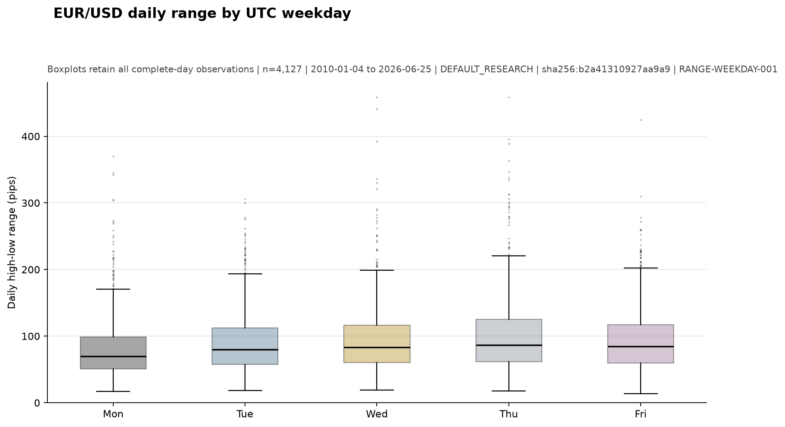
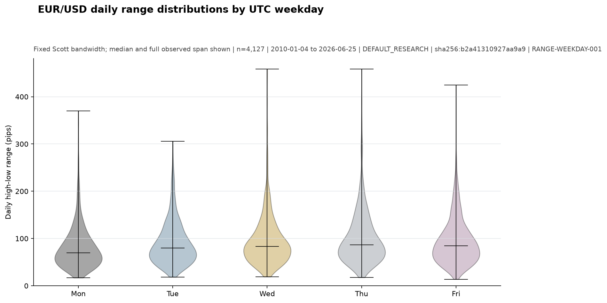
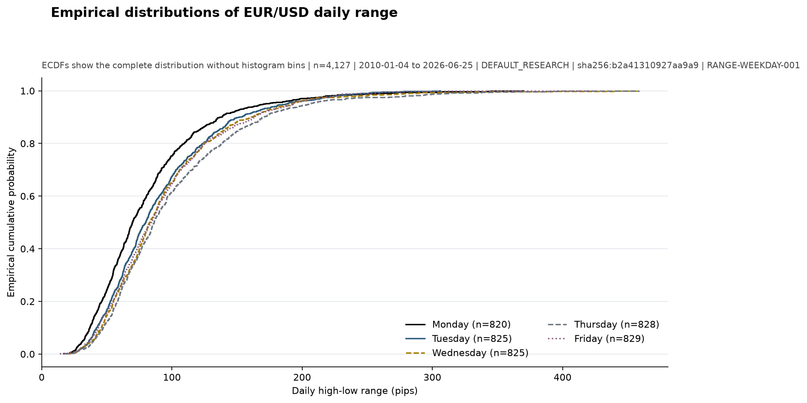
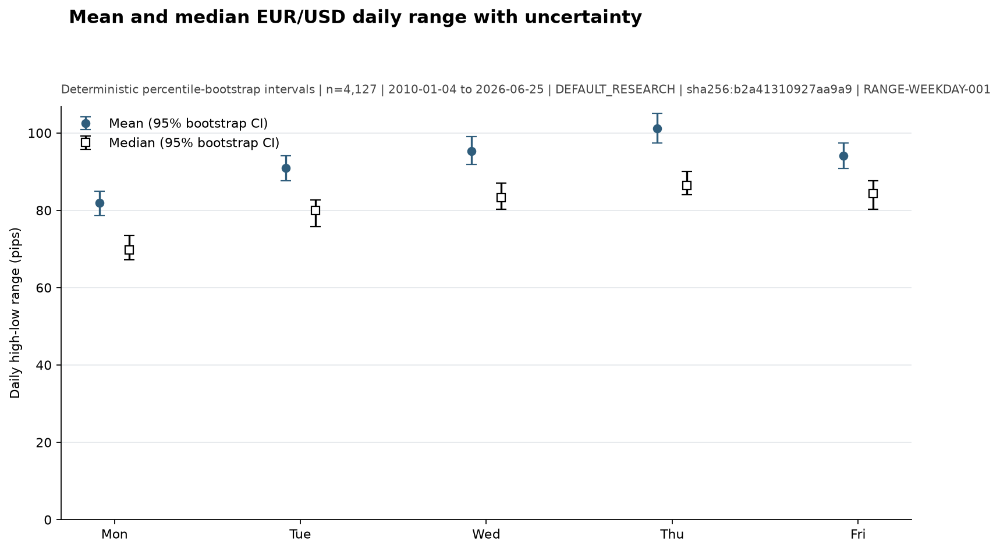
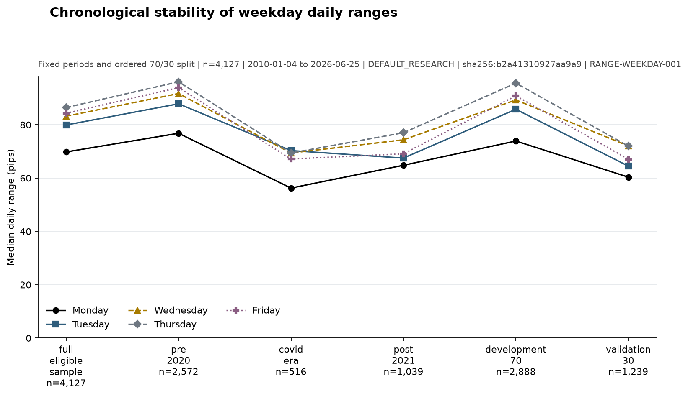
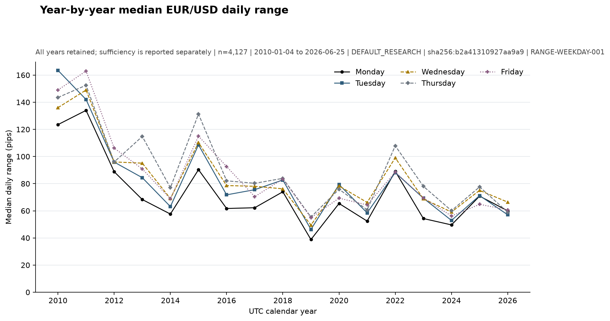
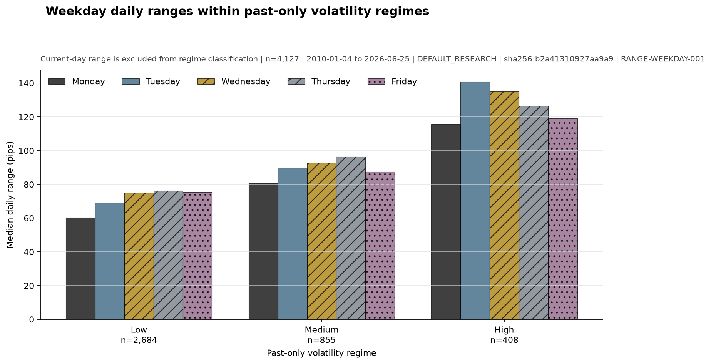
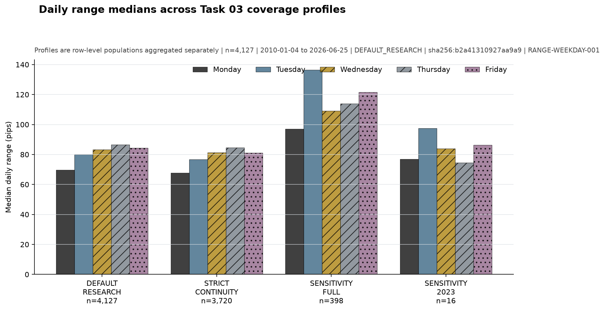

# Daily Range Behaviour by Weekday

## Registration classification

**correctively registered replication of the developed Task 04 analysis**.

The study design was locked before the corrected production regeneration. However, the underlying analysis had already been developed and its results reviewed. The corrected production run is therefore treated as a registered replication of the development analysis, not as a pristine first-look preregistration.

## Executive conclusion

The evidence suggests that the UTC-weekday daily-range distributions differ, with an omnibus epsilon-squared of 0.0186. The practical and temporal stability is reflected in a conservative MODERATE evidence rating; the result is descriptive and not a trading strategy.

Evidence rating: **MODERATE**.

## Research question

Does the distribution of EUR/USD daily high-low range differ across UTC weekdays?

## Registered hypotheses

- Null: The distribution of EUR/USD daily high-low range is identical across Monday, Tuesday, Wednesday, Thursday, and Friday under the preregistered daily and eligibility definitions.
- Alternative: At least one weekday has a different daily high-low range distribution.

## Population reconciliation

The primary analysis contains 4,127 complete `DEFAULT_RESEARCH` Monday-Friday UTC dates. All observed dates, partial dates, weekend dates, boundary dates, and sensitivity memberships remain in the machine-readable reconciliation and daily metadata.

## Daily aggregation methodology

Daily open/high/low/close use the earliest open, maximum high, minimum low, and latest close among profile-eligible M15 observations on each UTC date. Range is `(high - low) / 0.0001` without pre-analysis rounding. Monday through Thursday require the complete 96-interval UTC grid; Friday ends at its audited RAW-DQ-001 weekly-boundary endpoint.

The authoritative candle-open-versus-candle-close timestamp convention remains unresolved. This registered replication assigns each supplied timestamp label to its supplied UTC date; a close-time convention could shift one M15 interval at date and weekly boundaries. Unresolved semantics cap the evidence rating at MODERATE.

## Coverage profile methodology

COVERAGE-001 masks are applied to raw rows before each daily aggregation. `DEFAULT_RESEARCH` is primary, `STRICT_CONTINUITY` is the required sensitivity, and `SENSITIVITY_FULL`/`SENSITIVITY_2023` are diagnostic populations rather than substitutes.

## Descriptive findings

The highest primary median was Thursday (86.45 pips) and the lowest was Monday (69.80 pips). Means, full percentile sets, dispersion, shape diagnostics, and deterministic confidence intervals are retained in `weekday_statistics.csv`.

The boxplot shows the median/spread comparison while retaining extreme observations; the shared zero baseline prevents visual exaggeration.

The fixed-bandwidth violin view makes distribution shape visible without changing the primary rank-based inference.

The ECDF exposes the full distribution and shows that weekday differences are not reducible to one average.

Mean and median intervals show the estimation uncertainty and the mean-median separation expected from right-skewed ranges.

## Primary omnibus test

Kruskal-Wallis H=80.5227, p=1.34975e-16, epsilon-squared=0.0185645. This is the registered-replication primary inferential result.

## Pairwise results

All ten comparisons are reported; 5 have Holm-adjusted p-values below the configured 0.05 threshold. Non-significant pairs are not suppressed.

## Effect sizes

Omnibus epsilon-squared, eta-squared, and omega-squared are reported with pairwise Cliff's delta, absolute mean/median differences, relative median differences, and median-difference bootstrap intervals.

## Confidence intervals

Mean, median, and pairwise median-difference intervals use 2,000 deterministic percentile-bootstrap resamples with seed 20260727. They use iid resampling and therefore do not remove serial dependence.

## Chronological validation

The final 30% validation period had p=0.00216501 and weekday-order rank correlation 0.700 with the full sample.

The period view compares the same weekday medians across fixed windows and the untouched final 30% validation segment.

## Year-by-year stability

17 calendar years met the preregistered per-weekday sample threshold; 9 had an unadjusted yearly omnibus p-value below 0.05. All years remain in the outputs, and ordering was not uniform.

Yearly medians show both recurring ordering and visible exceptions; the sufficiency flag remains authoritative for interpretation.

## Volatility-regime stability

3,947 dates received LOW, MEDIUM, or HIGH labels from strictly past-only information; warm-up dates remain unclassified. Omnibus p-values were 6.315e-16 (LOW), 0.001135 (MEDIUM), and 0.411 (HIGH), so the relationship did not persist in the HIGH regime.

The regime comparison uses only lagged past information and makes the HIGH-regime instability visible.

## Coverage-profile sensitivity

STRICT_CONTINUITY remained significant with rank correlation 0.90 against the primary ordering. The diagnostic SENSITIVITY_FULL and SENSITIVITY_2023 populations contained 398 and 16 complete dates and were not significant; their ordering was not concordant with the primary population.

The coverage comparison shows why diagnostic sensitivity-only populations are not interchangeable with the primary profile.

## Extreme-event sensitivity

The raw primary result remains authoritative. The 1st/99th winsorised and largest-1%-excluded comparisons retained the same weekday median ordering, with p-values 1.339e-16 and 2.091e-15; both transformations are reversible sensitivity checks only.

## Evidence rating

**MODERATE** under the exact registered multi-dimension logic. A small full-sample p-value cannot by itself produce a strong rating.

## Observed facts

The primary Kruskal-Wallis comparison returned p=1.34975e-16 across 4,127 complete UTC weekday dates. The registered weekday median order was Thursday|Friday|Wednesday|Tuesday|Monday.

## Possible explanations

The study did not test mechanisms. Calendar-linked information flow, liquidity conditions, and event timing are possible explanations only and are deferred to separately registered research.

## Trading implications

Weekday may be relevant as a contextual range-expectation variable only if the effect is stable and economically meaningful. This study does not establish direction, profitability, or a trading rule.

## Limitations

- Raw timestamp open-versus-close convention is unresolved.
- Daily observations may be serially dependent and volatility-clustered.
- UTC calendar days are descriptive and are not local trading sessions.
- Task 02 coverage categories do not establish market-calendar causes.
- Complete-day filtering can alter the represented date population.
- Sensitivity-only profiles are diagnostic populations, not substitutes for the primary population.
- Range behaviour does not establish direction, profitability, or a trading rule.

## Registration deviations

None.

## Recommended future research

The next task should remain separately registered. A suitable follow-up is to validate one bounded mechanism or external calendar explanation without changing this study's completed definitions.
